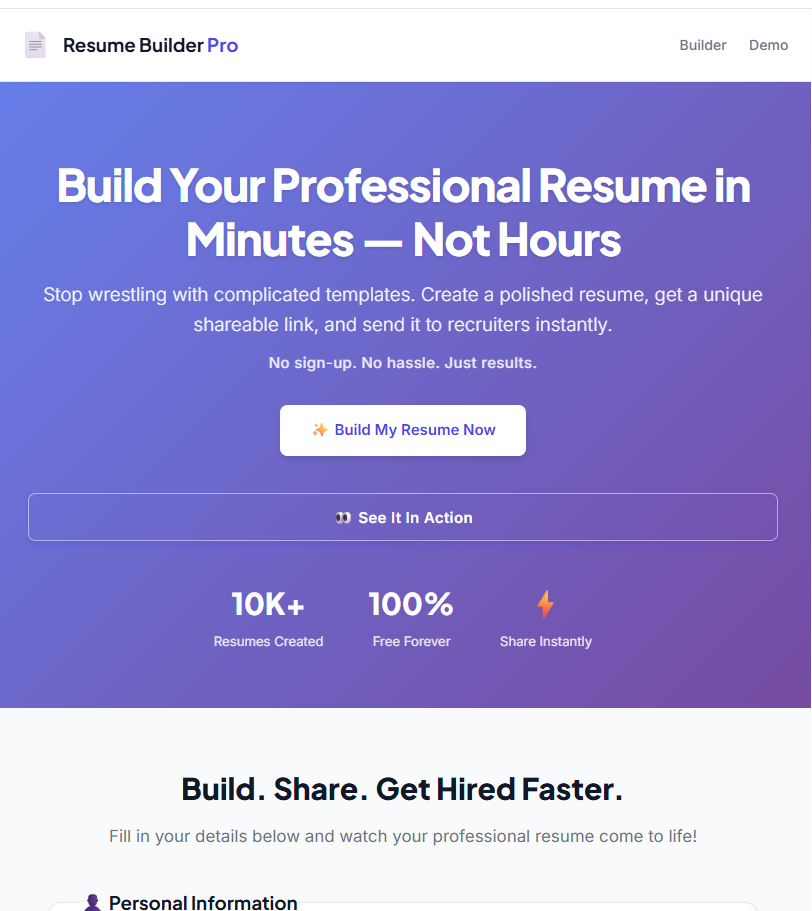

# Resume Builder Pro

**Build. Share. Get Hired Faster.**

Stop wrestling with complicated templates. Create a polished, professional resume, get a unique shareable link, and send it to recruiters instantly.

No sign-up. No hassle. Just results.

👉 **[Try It Free](https://resume-with-unique-path-and-shareable-link.vercel.app/)**

---

## ✨ Why Resume Builder Pro?

| Feature | Benefit |
|---------|---------|
| ⚡ **Instant Generation** | Fill in your details, get a professional resume in real-time |
| 🔗 **Unique Shareable Link** | One clean URL — no attachments, no compatibility issues |
| 🎨 **Beautiful by Default** | Modern typography and layout, zero design skills needed |
| 📱 **Works Everywhere** | Build your resume on desktop, tablet, or mobile |

---

## 🚀 Overview

This project is a dynamic resume builder that generates a unique URL for each resume, making it easy to share online. Users can create, edit, and host resumes with customizable sections and instantly share them with recruiters, colleagues, or friends.

### ✨ Features

- **Unique path generation** for each resume
- **Shareable link** for quick access
- **Customizable resume sections** (education, experience, skills, projects)
- **Clean and responsive design**
- **Easy deployment and hosting**
- **Demo mode** to try before you fill

### 🛠️ Tech Stack

- **Frontend:** HTML5, CSS3, JavaScript (ES6+)
- **Styling:** Custom CSS with CSS Variables, Flexbox & Grid
- **Fonts:** Inter & Plus Jakarta Sans (Google Fonts)
- **Deployment:** Vercel

### 📦 Installation

```bash
# Clone the repository
git clone https://github.com/zahidaraees/Resume-with-Unique-Path-and-Shareable-Link.git

# Navigate to project folder
cd Resume-with-Unique-Path-and-Shareable-Link

# Open in your browser
open index.html  # Mac
start index.html # Windows
xdg-open index.html # Linux
```

> **Note:** This is a static site — no build tools or dependencies required!

---

## 🎥 Demo

**Live Demo:** [https://resume-with-unique-path-and-shareable-link.vercel.app/](https://resume-with-unique-path-and-shareable-link.vercel.app/)



### Try the Demo Mode:
1. Visit the live site
2. Click **"👀 See It In Action"**
3. Watch a professional resume auto-fill and generate

---

## 💡 Use Cases

- 🎓 **Students** sharing resumes with recruiters
- 💼 **Job seekers** creating professional resumes quickly
- 🎨 **Freelancers** showcasing portfolios
- 📋 **Recruiters** accessing resumes via shareable links
- 🌍 **Anyone** who needs a resume without complicated software

---

## 📈 Roadmap

- [ ] Add multiple resume templates (Modern, Classic, Minimal)
- [ ] Enable PDF export with jsPDF
- [ ] AI-powered resume suggestions
- [ ] Analytics for resume views
- [ ] Dark mode support
- [ ] Multi-language support
- [ ] Custom color themes

---

## 🤝 Contributing

Contributions are welcome! Please read our [Contributing Guide](CONTRIBUTING.md) for details.

### Quick Start:

1. **Fork** the repository
2. **Create** a feature branch (`git checkout -b feature/amazing-feature`)
3. **Commit** your changes (`git commit -m 'Add amazing feature'`)
4. **Push** to the branch (`git push origin feature/amazing-feature`)
5. **Open** a Pull Request

---

## 📜 License

This project is licensed under the MIT License — see the [LICENSE](LICENSE) file for details.

---

## 🙏 Acknowledgments

- Built with ❤️ by **Zahida Raees**
- Fonts: [Inter](https://fonts.google.com/specimen/Inter) & [Plus Jakarta Sans](https://fonts.google.com/specimen/Plus+Jakarta+Sans)
- Deployed on [Vercel](https://vercel.com)

---

## 📬 Support

- 🐛 **Bug Reports:** [Open an Issue](https://github.com/zahidaraees/Resume-with-Unique-Path-and-Shareable-Link/issues)
- 💡 **Feature Requests:** [Start a Discussion](https://github.com/zahidaraees/Resume-with-Unique-Path-and-Shareable-Link/discussions)
- 📧 **Contact:** Reach out via GitHub

---

<div align="center">

**If you find this project helpful, please consider giving it a ⭐️!**

Made with ❤️ by [Zahida Raees](https://github.com/zahidaraees)

</div>
